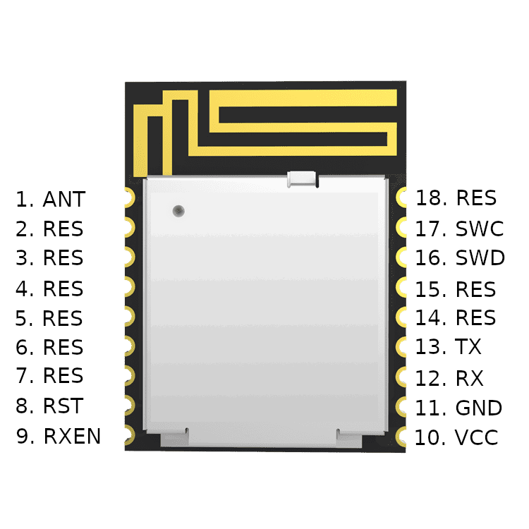
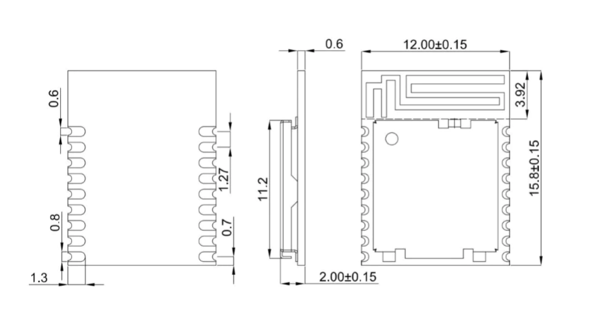
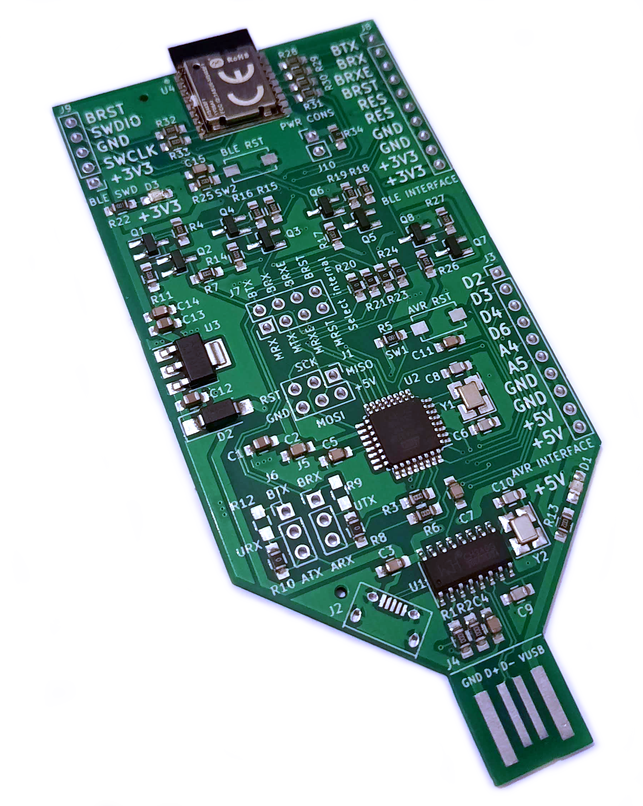

# Introduction

Simple BLE is a Bluetooth module that lets you quickly and simply use BLE in your project. Simple BLE is also this library. Goal of this project is to expose all of the BLE functionality over AT interface, and later over I2C and SPI. Curently only a subset of functionality is exposed, for example only BLE peripheral device role is supported ( so no scanning is currently possible ). This makes Simple BLE great for applications where you have to connect to your device and configure it, or read some sensor data from it, either using your phone or some other device capable for BLE connectivity.

# Hardware

SimpleBLE module's hardware is based on Nordic's NRF52805 chip which is one of the cheapest BLE options out there, making it ideal even for low budget projects, like hobby projects usualy are.

Module works with voltages from 1.7V to 3.6V and typical usage is with 3.3V. Power consumption while everything is off is about 1uA. Of course when Bluetooth gets turned on consumption increases based on how often module advertises and is something connected to it. Detailed power consumption info can be found in NRF52805 [datasheet](https://infocenter.nordicsemi.com/pdf/nRF52805_PS_v1.2.pdf "NRF52805 datasheet").

## Pinout



As can be seen, most of the pins are reserved(RES). Pins 10(VCC) and 11(GND) are module power pins. As was mentioned module can be powered with voltages ranging from 1.7V up to 3.6V.

Next to those pins there are UART interface pins, pins 12(RX) and 13(TX) . Simple BLE module uses TX pin to send data to the connected device and RX pin to receive data. That should be self explanatory, but some modules don't follow this convention.

On the other side of the module there are two more pins of interest. Pin 8(RST) which is module reset. Low level on this pin will cause the module to reset, and in normal operation it should be set to high level.

Pin 9(RXEN) which is RX enable pin. High level on this pin enables module's RX pin. This means that only with this pin high module can receive data over UART. When this pin is low UART reception is disabled and UART peripheral inside module is in its lowest power state. That is why if low power is important in your project **you should set this pin high only when sending commands**. Also, after this pin goes from low to high **UART interface is not ready imediately, but after about 10ms**.

Pins 16(SWD) and 17(SWC) are SWD programming interface.

## Dimensions



Module dimensions are expressed in millimeters.

# Module firmware

Simple BLE module is based on Nordic's SDK for BLE and periphery devices. To simplify BLE design most of the BLE parameters are preconfigured and can't be changed. If your application needs to change some of these hardcoded parameters feel free to contact us at [d0d0.addr@gmail.com](d0d0.addr@gmail.com) .

Simple BLE module is controlled with AT commands through UART interface for simplicity. This does introduce a lot of overhead so if your application requires something different contact us ([d0d0.addr@gmail.com](d0d0.addr@gmail.com)) and we can talk about alternative communication protocols.

## UART configuration

Default UART configuration is 9600 baud, with 8 data bits, 1 stop bit and no parity bit. This can't be changed, except for speed which can be changed by write command *AT+SETBAUD=\<newBaud\>*.

Supported baudrates are 1200, 2400, 4800, 9600 14400, 19200, 28800, 31250, 38400, 56000, 76800, 115200, 230400, 250000, 460800, 921600 and 1000000 .
In order for new UART speed to be in effect, pin RXEN needs to be de-asserted(HIGH to LOW) and asserted(LOW to HIGH). After assertion new speed will apply. For now speed setting is not saved to ROM, so after reset speed will always be the default speed.

## AT command interface

There are three types of AT commands, read commands, write commands and switch commands. Read commands are used for reading configuration from Simple BLE module, and write commands are used for writting configuration to modem.

* Read command sintax is ```"AT+COMMAND?"``` where ```COMMAND``` is one of the supported commands. Notice the question mark ```?``` at the end of command.

* Write command sintax is ```"AT+COMMAND=<commaSepparatedArgumentList>"``` where ```COMMAND``` is again one of the supported commands, and after that comes the ```=``` sign, and after it ```<commaSepparatedArgumentList>```.

* Switch command is without question mark, so ```"AT+COMMAND"``` where ```COMMAND``` is one of the supported commands. Switch commands can have their own functionality, or share functionality with a read command or with a write command.

For example ```<commaSepparatedArgumentList>``` could be ```1,3,107``` or ```4532``` depending on command. So for the first example, complete command would look like this: ```"AT+COMMAND=1,3,107"``` and for the second example complete command would look like this: ```"AT+COMMAND=4532"``` .

Commands should always end with carriage return character. After carriage return is received by Simple BLE module it will start processing the command. Module always gives echo back, and sends the response to sent command. At the end of command processing ```"OK"``` is always sent to signal that processing of the command is complete and that module is ready for new command. Even if there is an error during processing of the command module will still send the ```"OK"``` . If error did occur during command processing you will also receive ```"ERROR"``` string along with some explanation string.

Module can send responses even when no AT commands requested them. These are called URC, Unsolicited Response Code, because they are not requested but are sent to signal that module internal state changed. URCs start with ```^``` sign, the same as any of the command responses.

One more thing to note is that UART interface receives bytes in batches of 6 in order to be as efficient as possible. For this reason there is a thing called UART receive timeout. If no character is received in more than UART receive timeout time then incomplete batch can be received for processing (less than 6 bytes) . This is great for manual input of commands, but if module is controlled from another source it is probably capable of higher speeds. This is why it is recomended to send aditional dummy characters over UART in order to fill the whole batch of 6 bytes. Simple BLE library takes care of this, but if you are developing your library you should take this into consideration.

## AT commands

In the table bellow is a list of all currently suported commands, along with some info about each command. Write arguments are written in the order as module expects them over UART interface. Every argument is a base 10 number.

| Command | Read | Write | Switch | Write arguments |
| ------- | ---- | ----- | ------ | --------------- |
| AT | No | No | Yes | - |
| AT+SETBAUD | No | Yes | No | \<newBaud\> |
| AT+RESTART | No | No | Yes | - |
| AT+STAT | Yes | No | No | - |
| AT+ADVSTART | Yes | Yes | Yes | \<advInt\>,\<advTimeout\>,\<restartOnDisconnect\> |
| AT+ADVSTOP | Yes | Yes | Yes | - |
| AT+ADVPAYLOAD | No | Yes | Yes | \<type\>,\<dataSize\> |
| AT+TXPOWER | Yes | Yes | Yes | \<dBm\> |
| AT+ADDSRV | No | Yes | Yes | \<uuid\> |
| AT+ADDCHAR | No | Yes | Yes | \<service\>,\<size\>,\<flags\> |
| AT+READCHAR | No | Yes | Yes | \<service\>,\<characteristic\>,\<returnData\> |
| AT+WRITECHAR | No | Yes | Yes | \<service\>,\<characteristic\>,\<writeLen\> |
| AT+FORCEDISC | No | Yes | Yes | - |

### AT

AT command is used to check if module works and is ready to receive AT commands. It doesn't do anything to the internal module state.

# Simple BLE library

This part of the documentation will focus on the library in this repository.

Simple BLE library is written in a way to be platform independant. We just pass it architecture dependant code like so:

```c++
static SimpleBLE ble(
    [](bool state) { digitalWrite(RX_ENABLE_PIN, state ? HIGH : LOW); },
    [](bool state) { digitalWrite(MODULE_RESET_PIN, state ? HIGH : LOW); },
    [](char c) { return altSerial.write(c) > 0; },
    [](char *c)
    {
        bool availableChars = altSerial.available() > 0;

        *c = availableChars ? altSerial.read() : *c ;

        return availableChars;
    },
    [](void) { return (uint32_t)millis(); },
    [](uint32_t ms) { delay(ms); },
    [](const char *dbg) { Serial.print(dbg); }
);
```

This can be found in examples folder and is specific to Arduino platform, however, you can specify functions for different platform instead of arduino ones and everything should work. Printing is optional so you can send NULL as the last argument to skip printing command output.

Function descriptions can be found in `simple_ble.h`.

## The example

The example in this repository is made for Arduino platform, specificaly for Arduino boards featuring ATMega328 microcontroller. So for Arduino Uno, Nano etc. this example should work without changes, but for other boards adjustements might be needed.

Since ATmega328 has only one hardware UART and we need two, one for printout and one for Simple BLE module, we will use software serial library called [AltSoftSerial](http://www.pjrc.com/teensy/td_libs_AltSoftSerial.html).

Example shows how to initialize and work with SimpleBLE module. When started it begins advertising its name, `SimpleBLE example`, over Bluetooth. When advertising begins it si possible to connect to this device and write to its characteristic, or read from it.

Connecting to this module can be achived easily by using smartphone applications and virtualy every smartphone today has a BLE capability. Nordic's [nRF Connect](https://www.nordicsemi.com/Products/Development-tools/nrf-connect-for-desktop) app is a good example of simple to use but powerful BLE testing application. And it is available both for [Android](https://play.google.com/store/apps/details?id=no.nordicsemi.android.mcp) and for [iOS](https://apps.apple.com/us/app/nrf-connect-for-mobile/id1054362403).

# SimpleBLE developement

SimpleBLE developement can be done on your custom board, or using one of our developement boards. There are two boards available, SimpleBLE breakout board and a SimpleBLE developement kit.

## Breakout board


Breakout board features a SimpleBLE module with all useful pins connected to a pin header. It has a 3V3 interface (J2 header) and a 5V interface (J4 header). It can be powered from 5V or from 3V3 voltage sources. RXE pin is enabled by default, and RST pin is pulled high, so when power is applied module will be ready within a few milliseconds. `^START` message is the first message sent over the UART and it indicates that the module has started and is ready to receive commands.

As was mentioned, default state of the module on this breakout board is enabled and receiving commands over UART. Default UART speed is 9600 baud.

Board also features pin header for measuring power consumption (J1 header). Just make sure to desolder R9 before doing the measurements because it bridges header pins. Other than that there is a reset switch SW1 which can be used to hardware reset a module.

Whole schematic is available in the doc folder [here](./doc/simpleble_lvl_breakout.pdf).

## Developement kit



Developement kit features everything that SimpleBLE breakout has, plus an Arduino integrated for easy developement. SimpleBLE module and ATmega328 are connected by a software serial port [AltSoftSerial](http://www.pjrc.com/teensy/td_libs_AltSoftSerial.html). Hardware serial port is connected to UART to USB chip for printout of debug information.

There is another switch, SW1, that resets only the ATmega. If you need to reset SimpleBLE module you can use SW2.

There is some I/O connected to J3 header if there is a need to control more periphery with your Arduino. Names of the pins correspond to Arduino naming scheme, so there shouldn't be any confusion when developing with Arduino platform.

R8 and R10 jumpers can be disconnected and with that TX and RX pins of UART to USB chip are disconnected from ATmega. Now it can be connected to some external board, or it could be connected to a SimpleBLE module directly if needed.

Dev kit also features a full USB-A connector for easy connection to other devices. It also has a micro USB connector if normal sized USB is not practical. **USBs shouldn't be connected at the same time, it could damage your dev kit.**

Whole schematic is available in the doc folder [here](./doc/simpleble_devboard.pdf).

# Issues and contact

If you have any issues with the library in this repository or with BLE module you can submit your issues on the [issue tracker](https://github.com/d0d0-the-bird/simpleble/issues) in this repositroy.

You can also write an email to [d0d0.addr@gmail.com](d0d0.addr@gmail.com) for any questions, and if you want to get your SimpleBLE modules or developement boards.

